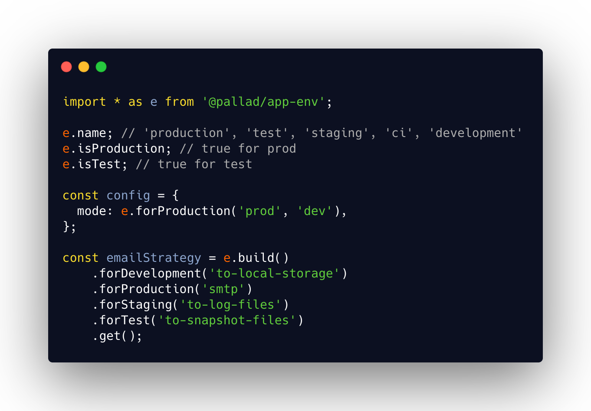

<div align="center">
	<h1>app-env 🕵️</h1>
	<p>What environment are you in?</p>
</div>

---
[](https://circleci.com/gh/pallad-ts/app-env/tree/master)
[](https://badge.fury.io/js/@pallad%2Fapp-env)
[](https://coveralls.io/github/pallad-ts/app-env?branch=master)
[](https://opensource.org/licenses/MIT)
---



Library to detect in which environment your app is working. Supports detection of following environments:

- production
- development
- test
- staging
- ci
- preview

If you need to support more environments see [#non-standard-environments](non standard environments)

Allows to easy change of environments through env variables.

# Use cases

* changing configuration based on detected environment
* changing application behavior for tests
* ability to force detected env on your command

# Features

* 👷 Built with Typescript with full types support
* 📝 Supports wider spectrum of environments than just `production` and `development`
* 🔥 Provides builder to easily change configs/flags/switchers in type safe manner

# Community

Join our [discord server](https://discord.gg/ZV4SwufSjT)

# Installation

```shell
npm install @pallad/app-env
```

# When do I need it?

* If you need to support more than 2 most common environments (production, development) in your app.
* If you need to change app behavior, config, flags based on detected behavior
* If you need an easy ability to change environment without affecting `NODE_ENV`
* If you hate ugly `process.env.NODE_ENV` comparisons in your code

# How is environment detected?

`@pallad/app-env` detects environment based on available env variables.

1. If `APP_ENV` env variable is supported environment name (case-insensitive) then use it, otherwise move to next step.
2. If `NODE_ENV` env variable is supported environment name (case-insensitive) then use it, otherwise move to next step.
3. If CI environment is detected then it is `ci`, otherwise move to next step.
4. Fallback to `development`

Based on that logic you can easily lib to use your desired environment by settings `APP_ENV` variable.

Run process in `test` environment

```shell
APP_ENV=test node some-process.js
```

Run process in `staging` environment. Note that `NODE_ENV` variable will be simply ignored.

```shell
APP_ENV=staging NODE_ENV=development node some-process.js
```

# API

## Name

```typescript
import * as e from '@pallad/app-env';

e.name; // 'test'
e.env; // 'test'
```

## Flags

```typescript
import * as e from '@pallad/app-env';

e.isProduction;
e.isDevelopment;
e.isStaging;
e.isTest;
e.isCI;
e.isPreview;
```

## Flag helpers

```typescript
import * as e from '@pallad/app-env';

e.is('production'); // true for production
e.isEnv('production'); // same as above

e.is('production', 'staging'); // true for production or staging
e.isEnv('production', 'staging'); // same as above
```

## Value helpers

```typescript
import * as e from '@pallad/app-env';

e.forEnv('production')('foo'); // returns "foo" for production, undefined otherwise
e.forEnv('production')('foo', 'bar'); // returns "foo" for production, "bar" otherwise

e.forEnv('production', 'staging')('foo'); // returns "foo" for production or staging, undefined otherwise
e.forEnv('production', 'staging')('foo', 'bar'); // returns "foo" for production or staging, "bar" otherwise

e.forDevelopment('foo'); // returns "foo" for development, undefined otherwise
e.forDevelopment('foo', 'bar'); // returns "foo" for development, "bar" otherwise

e.forCI('foo')
e.forStaging('foo')
e.forTest('foo')
e.forProduction('foo')
```

## Advanced value builder

Ultimate helper of all helpers. Extends [@pallad/builder](https://github.com/pallad-ts/builder).

```typescript
import * as e from '@pallad/app-env';

const value = e.build()
	.forDevelopment('foo')
	.forStaging('bar')
	.forEnv(['production', 'test'], 'baz')
	.getOrDefault('wtf?'); // or just .get() to get value without default
```

Note that the order of chaining is important

```typescript
const value = e.build()
	.forDevelopment('foo')
	.forStaging('bar')
	.forEnv(['development', 'test'], 'baz')
	.get(); // you'll get "foo" (not "baz") for development since it was first evaluated rule
```

# Non standard environments

While library by default supports most of commonly known environment names sometimes you might have special environments
that are not covered.

For such cases you can create your own configuration with custom names.

```typescript
import {Configuration} from '@pallad/app-env';

const envConfig = new Configuration(['e2e', 'eu_region']);
const info = envConfig.create('e2e');

info.isEnv('e2e') // true
info.isProduction // false

envConfig.getEnvNameFromProcess(); // e2e or eu_region might be properly detected
```

Note that old environment names like production, development, CI etc are still available.

Such created instance of `Configuration` allows you to create env info, value builder and detect env from environment
variables and accepting new environment names.
